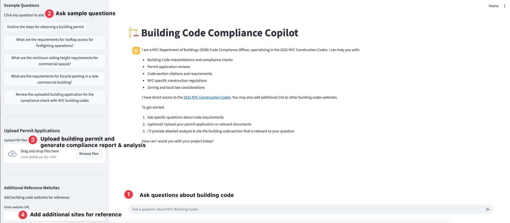

## Building Code Compliance Copilot



This Streamlit application is an AI copilot for NYC Department of Buildings (DOB) code questions and permit application reviews. It uses NVIDIA NIM language models via LangChain to answer questions about the 2022 NYC Construction Codes and any additional reference sites you provide. Optionally, you can upload PDF permit/application documents; the app will chunk and embed them with FAISS so responses can cite and reason over your own documents alongside official code references.

### Features
- **NYC focus**: Tailored to the 2022 NYC Construction Codes with links and citations
- **Q&A chat**: Ask free‑form questions; answers stream in real time
- **Document review (RAG)**: Upload building permit applications in PDFs, vectorized with FAISS for retrieval‑augmented answers
- **Reference curation**: Add/remove trusted reference websites in the sidebar

### How to use
- Ask a question directly in the chat, or click an example prompt in the sidebar.
- Optionally upload one or more PDF files, click "Process Documents" to embed them, then ask questions referencing their content.
- **Sample file included**: Use `building_permit_application_sample.pdf` to test the document review functionality.
- Add additional reference websites in the sidebar; the app will include them in the system prompt for better citations.

### Tech stack
- **UI**: Streamlit
- **AI**: NVIDIA NIM `meta/llama-3.1-70b-instruct` via `langchain_nvidia_ai_endpoints`
- **RAG**: `langchain`, `faiss-cpu`, `pypdf`

---

### Quickstart (running local)
1. Clone and enter the repo
```bash
git clone <your-fork-or-repo-url>
cd Building_Permit_NIM_github
```
2. Create a virtual environment and install dependencies
```bash
python3 -m venv .venv
source .venv/bin/activate  # Windows: .venv\\Scripts\\activate
pip3 install -r requirement.txt
```
3. Configure environment variables (create a `.env` file)
```bash
# .env
NVIDIA_API_KEY=YOUR_NVIDIA_API_KEY
```
4. Run the app
```bash
streamlit run app.py
```
Then open the URL shown (default `http://localhost:8501`).

---

### Configuration notes to use local models
- Default LLM: `meta/llama-3.1-70b-instruct` via NVIDIA NIM Cloud version. You can point to a local compatible endpoint by adjusting the `ChatNVIDIA` initialization in `app.py`.
```python
llm = ChatNVIDIA(base_url="http://0.0.0.0:8005/v1", model="llama-3.1-70b-instruct", streaming=True)
```
- Ports: Streamlit runs on 8501 (exposed in Docker and manifests).
- Requirements file: local installs use `requirement.txt`.

---

### Docker
Build and run with Docker:
```bash
docker build -t building-app:latest .
# pass env via file or -e; expose Streamlit port
docker run --rm -p 8501:8501 --env-file .env building-app:latest
```

---

### OpenShift/Kubernetes deployment
1. Push an image that your cluster can pull (or adjust the image in `building-app-deployment.yaml`).
2. Provide the `NVIDIA_API_KEY` by updating placeholder value in `building-app-deployment.yaml`.
3. Apply manifests:
```bash
kubectl apply -f building-app-deployment.yaml
# Or using the oc command 
oc apply -f building-apply-deployement.yaml
# OpenShift route (for external access)
oc apply -f building-app-route.yaml
```
Access the app via the Service/Route URL provided by your cluster.

> Security note: Avoid committing API keys to source control. Use environment variables or Kubernetes Secrets.

---

### Repository structure
```
app.py                       # Streamlit app
Dockerfile                   # Container build
requirement.txt              # Python dependencies
building-app-deployment.yaml # Deployment + Service
building-app-route.yaml      # OpenShift Route
README.md                    # You are here
```

---

